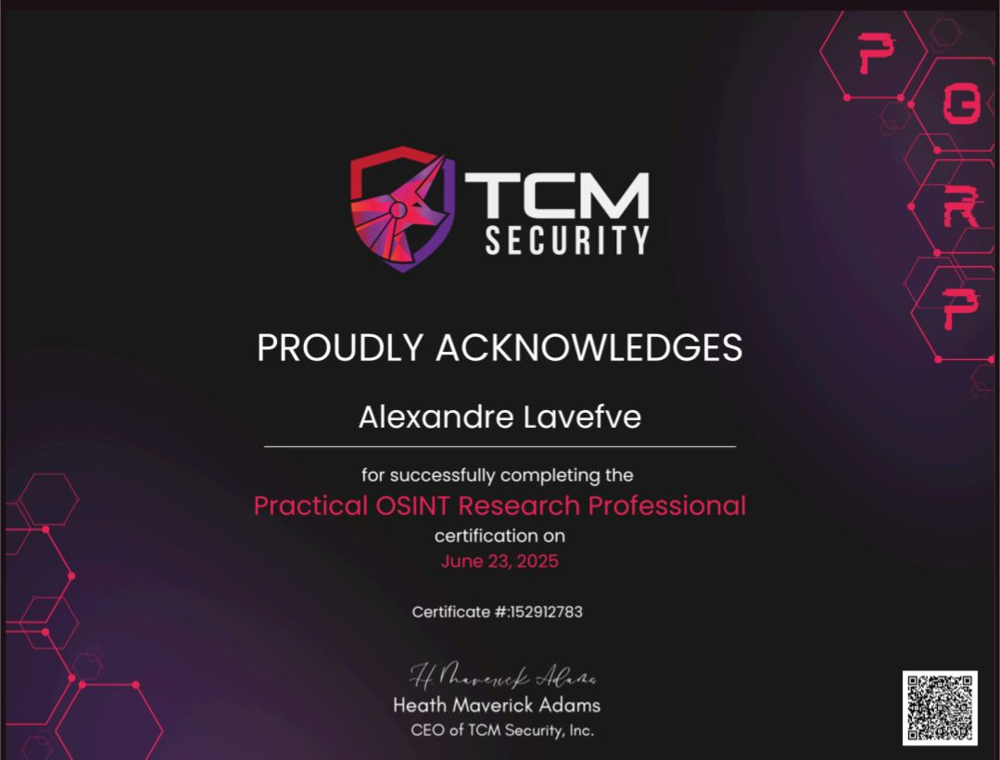

Bonjour à toi qui arrive ici :).

Actuellement analyste au CERT santé, tu trouvera ici mes notes concernant la cybersécurité (et un peu d'informatique généraliste). En espérant que ça puisse te servir autant qu'à moi.

---
Me contacter :

[@Linkedin](https://www.linkedin.com/in/alexandre-lavefve/) 
@pakdekro sur discord

---
### Certifications

---
### Prolabs

